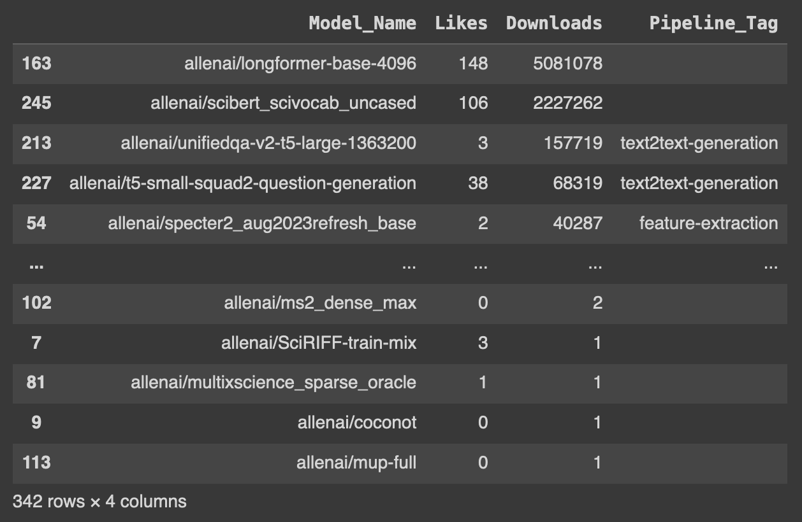

# 📚 Text Embedding and Hugging Face Model Fetching Toolkit

Welcome to the **Text Embedding and Hugging Face Model Fetching Toolkit**! This repository provides a comprehensive set of tools for text embedding using various methods and fetching HuggingFace models. It includes custom classes and functions to make your NLP tasks easier and more efficient.

## 🌟 Features

- **Multiple Text Embedding Methods**: Supports TF-IDF, Count, Binary vectorizers, and various dimensionality reduction techniques.
- **HuggingFace Model Fetching**: Fetch models from HuggingFace and sort them based on downloads and likes.
- **Custom RAM Cleanup**: Efficient memory management with a custom RAM cleanup function.
- **Preprocessing Utilities**: Functions to remove punctuation and stop words, and to preprocess text.

## 📂 Project Structure

```plaintext
.
├── embedding.py                      # Contains the TextEmbedding class
├── HF_Model_ALLENAI.png              # HF Model Result
├── model_fetcher.py                  # Contains the HuggingFaceModelFetcher class
├── README.md                         # Project README
├── requirements.txt                  # List of dependencies
├── Test1.csv                         # Random Product Titles
└── text_to_vector_embedding.ipynb    # Contains complete codes with outputs
```

### Jupyter Notebook:

Explore the detailed implementation and outputs in the Jupyter Notebook.

- [Text-2-Vector-Embedding-Implmentation](text_to_vector_embedding.ipynb)

## 🚀 Installation

To get started, clone the repository and install the required packages:

```bash
git clone https://github.com/sherozshaikh/text_to_vector_embedding_pipeline.git
cd text_to_vector_embedding_pipeline
pip install -r requirements.txt
```

Make sure to download the necessary models and NLTK stopwords:

```python
!pip install sentence-transformers spacy-transformers nltk laserembeddings
!python -m laserembeddings download-models
!python -m spacy download en_core_web_sm
nltk.download(['punkt', 'stopwords'])
```

## 🛠️ Usage

### Text Embedding

```python
import gensim.downloader as api
from embedding import TextEmbedding

text_to_vector = TextEmbedding()
word_embedding_model = api.load("glove-wiki-gigaword-50")
# Check for more models here -> https://radimrehurek.com/gensim/models/word2vec.html

# Load your text data
test_file = pd.read_csv('Test1.csv', dtype='str', encoding='utf-8')
test_sample = test_file.iloc[0]['Title']

# Preprocess and embed text
print(f'{clean_text = }')
clean_text = text_to_vector.pre_processing_text(txt=test_sample)
print(f'{clean_text = }')
word_embeddings = text_to_vector.get_word_embedding(texts=[clean_text], model_name=word_embedding_model)

print(f'{word_embeddings.shape = }')
```

### HuggingFace Model Fetching

```python
from model_fetcher import HuggingFaceModelFetcher

hf_model_fetcher = HuggingFaceModelFetcher(url_to_parse='https://huggingface.co/allenai', close_time=10)
model_results_df = hf_model_fetcher.fetch_model_details()

print(model_results_df.head())
```
<p align="middle">
  
</p>

### Frequently Used Model Parent Links

Here are some frequently used models from HuggingFace:

- **[OpenAI Community](https://huggingface.co/openai-community)** - `https://huggingface.co/openai-community`
- **[Google BERT](https://huggingface.co/google-bert)** - `https://huggingface.co/google-bert`
- **[Facebook AI](https://huggingface.co/FacebookAI)** - `https://huggingface.co/FacebookAI`
- **[DistilBERT](https://huggingface.co/distilbert)** - `https://huggingface.co/distilbert`
- **[ALBERT](https://huggingface.co/albert)** - `https://huggingface.co/albert`
- **[Google](https://huggingface.co/google)** - `https://huggingface.co/google`
- **[Microsoft](https://huggingface.co/microsoft)** - `https://huggingface.co/microsoft`
- **[AllenAI](https://huggingface.co/allenai)** - `https://huggingface.co/allenai`
- **[XLNet](https://huggingface.co/xlnet)** - `https://huggingface.co/xlnet`
- **[Flair](https://huggingface.co/flair)** - `https://huggingface.co/flair`
- **[Nguyễn Xuân Huy](https://huggingface.co/nghuyong)** - `https://huggingface.co/nghuyong`
- **[Sentence Transformers](https://huggingface.co/sentence-transformers)** - `https://huggingface.co/sentence-transformers`

### Custom RAM Cleanup

```python
custom_ram_cleanup_func()
```
